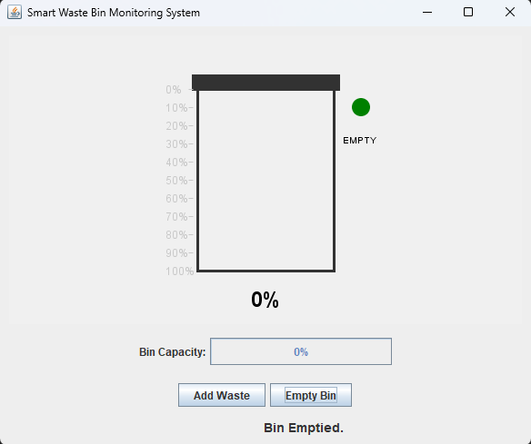
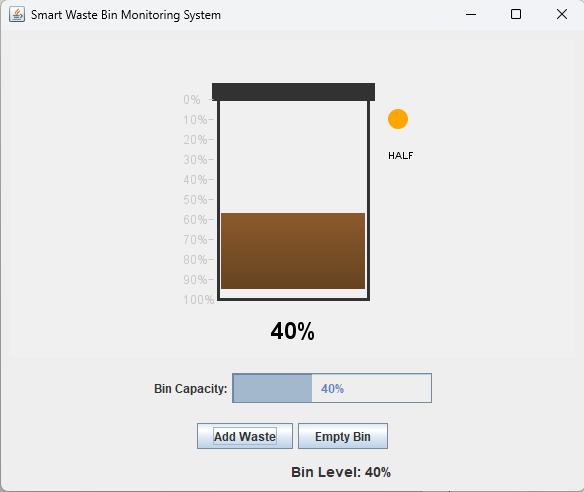

# 🗑️ Smart Waste Bin Monitoring System

### 🎓 College OOP Mini Project  
This project was created as part of my journey in learning **Java** and exploring **Object-Oriented Programming (OOP)** concepts.

---

## 📘 Project Description
The **Smart Waste Bin Monitoring System** is a Java-based GUI application that simulates a smart waste management process.  
It uses **OOP principles** such as Encapsulation, Inheritance, and Polymorphism to represent real-world waste monitoring behavior.  

The system visually displays the **bin’s fill level** using a progress indicator.  
When the bin level exceeds a certain threshold (e.g., 80%), the program displays a **warning alert** to prompt the user to empty the bin.  
This helps demonstrate how **IoT-inspired smart monitoring systems** can be prototyped using **Java Swing GUI**.

---

## ⚙️ Features
- Real-time bin level updates  
- Visual GUI representation  
- Alert notifications when bin is almost full  
- Option to empty the bin  
- Interactive and beginner-friendly design  

---

## 🧠 Concepts Used
- Classes and Objects  
- Encapsulation and Inheritance  
- Event Handling  
- GUI Programming using **Java Swing**  

---

## 🧰 Requirements
- **Java JDK 8 or higher**  
- Any Java IDE (Eclipse, IntelliJ IDEA, or BlueJ)

---

## 🚀 How to Run
1. Clone or download this repository.  
2. Open your IDE and create a new Java project.  
3. Create a file named `SmartWasteBin.java`.  
4. Paste the provided source code.  
5. Run the program — a GUI window will appear displaying the bin simulation.

---

## 🖼️ Screenshots

### 🟢 Bin Empty

### 🟠 Bin Half Full

---

## 👨‍💻 Author
**Mani Maran**  
> Developed as part of my **college mini project** during my learning journey in Java.

---

## 📜 License
This project is open-source and free to use for educational purposes.
